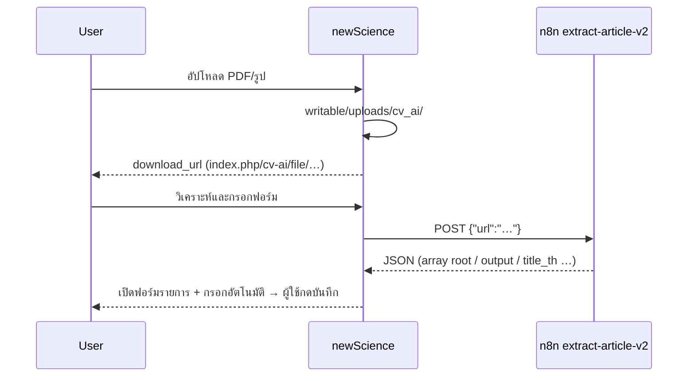

# CV AI Workflow Tester

Agent สำหรับตรวจ workflow **เพิ่มบทความวิจัยด้วย AI** ใน newScience (เทียบ Research Record `publication-ai.js`)

## Workflow ที่ต้องผ่าน



## ก่อนรันทดสอบ

ตรวจ `.env`:

| ตัวแปร | ต้องมี |
|--------|--------|
| `app.baseURL` | โดเมนที่ **n8n เข้าถึงได้** (เช่น `https://sci.uru.ac.th/`) — ไม่ใช่ localhost |
| `AI_CV_N8N_URL` | `https://n8n.kidcbc.work/webhook/extract-article-v2` |
| `AI_CV_ENABLED` | `true` (หรือมี N8N URL) |

ไฟล์ที่เกี่ยวข้อง:

- `app/Libraries/CvAiFileStorage.php` + `app/Services/CvAiFileService.php`
- `app/Libraries/AiPublicationParser.php` — `parseN8nResponse`, `normalizePublicationFromRrLikeArray`
- `app/Controllers/User/ProfileCv.php` — `aiPublicationUpload`, `aiPublicationPreview`
- `app/Views/user/profile/cv_manage.php` — modal + JS (auto-fill แบบ RR)
- Routes: `POST …/ai-publication-upload`, `POST …/ai-publication-preview`, `GET index.php/cv-ai/file/{storedName}`

## รันทดสอบอัตโนมัติ (ทำทุกครั้ง)

จาก root โปรเจกต์ (แนะนำใน Docker `shared_php`):

```bash
# 1) Unit tests
docker exec -w /var/www/html/newscience shared_php \
  ./vendor/bin/phpunit --filter 'AiPublicationParser|CvAiWorkflow'

# 2) Workflow integration (spark command)
docker exec -w /var/www/html/newscience shared_php \
  php spark cv:test-ai-workflow

# 3) เรียก n8n จริง (ใช้ PDF สาธารณะ)
docker exec -w /var/www/html/newscience shared_php \
  php spark cv:test-ai-workflow --live-n8n
```

Exit code `0` = ผ่านทุกขั้นที่บังคับ; `--live-n8n` ล้มเหลวได้ถ้า n8n/เครือข่ายมีปัญหา

**เมื่อผู้ใช้ขอให้ agent ทดสอบ workflow:** อ่าน skill นี้แล้วรันคำสั่งข้อ 1–2 (และ 3 ถ้ามี network) โดยไม่ถามซ้ำ — รายงานสรุป pass/fail

## ทดสอบมือใน UI

1. ล็อกอิน → แก้ไข CV → หัวข้อ **งานวิจัย/บทความ**
2. กด **ช่วยเติมด้วย AI**
3. เลือกไฟล์ PDF เล็กๆ → ต้องเห็น "✓ อัปโหลดแล้ว"
4. กด **วิเคราะห์และกรอกฟอร์ม** → modal ปิด → ฟอร์มรายการเปิดพร้อมข้อมูล
5. ตรวจสอบแล้วกด **บันทึก** → `cv_entries.metadata.source = ai_assistant`

## Debug เมื่อล้มเหลว

| อาการ | สาเหตุที่พบบ่อย |
|--------|------------------|
| อัปโหลดไม่ได้ | CSRF, ขนาดไฟล์ >10MB, นามสกุลไม่รองรับ |
| n8n ไม่ได้รับไฟล์ | `app.baseURL` เป็น localhost หรือไฟล์ไม่อยู่ `writable/uploads/cv_ai/` |
| 404 ที่ cv-ai/file | IIS/route — ใช้ `index.php/cv-ai/file/…` แบบ Edoc |
| n8n HTTP 4xx/5xx | URL webhook ผิด, token, workflow ปิด |
| ไม่มี title ใน preview | JSON ไม่ตรงรูปแบบ — ดู `tests/fixtures/cv_ai_n8n_response_sample.json` และ `cv_ai_n8n_response_array_root.json` |
| ปุ่ม AI ไม่ขึ้น | `AiCv::isReady()` false — ตั้ง `AI_CV_N8N_URL` |

ทดสอบ URL ไฟล์:

```bash
docker exec shared_php php /var/www/html/newscience/spark cv:probe-ai-file {storedName}
```

## สิ่งที่ agent ต้องรายงานหลังรัน

1. ผล `phpunit` + `cv:test-ai-workflow` (สรุป pass/fail)
2. ถ้า `--live-n8n` ล้มเหลว — ข้อความ error จาก parser (ไม่ log API key)
3. แนะนำแก้ `app.baseURL` ถ้ายังชี้ localhost
