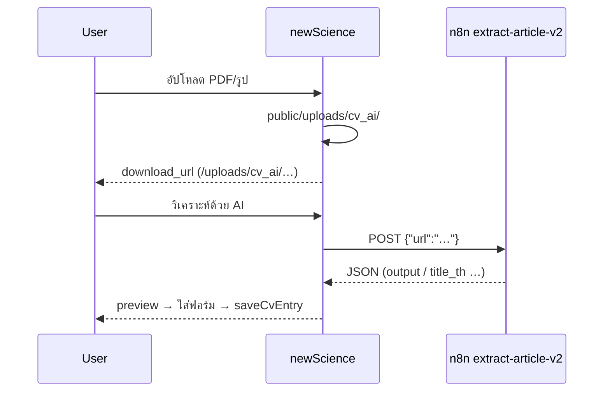

# CV AI Workflow Tester

Agent สำหรับตรวจ workflow **เพิ่มบทความวิจัยด้วย AI** ใน newScience (เทียบ Research Record)

## Workflow ที่ต้องผ่าน



## ก่อนรันทดสอบ

ตรวจ `.env`:

| ตัวแปร | ต้องมี |
|--------|--------|
| `AI_CV_N8N_URL` | `https://n8n.kidcbc.work/webhook/extract-article-v2` |
| `AI_CV_FILE_PUBLIC_BASE_URL` | โดเมนที่ **n8n เข้าถึงได้** (ไม่ใช่ localhost) |
| `AI_CV_ENABLED` | `true` (หรือมี N8N URL) |

ไฟล์ที่เกี่ยวข้อง:

- `app/Libraries/CvAiFileStorage.php`
- `app/Libraries/AiPublicationParser.php`
- `app/Controllers/User/ProfileCv.php` — `aiPublicationUpload`, `aiPublicationFile`, `aiPublicationPreview`
- `app/Views/user/profile/cv_manage.php` — modal + JS
- Routes: `POST …/ai-publication-upload`, `POST …/ai-publication-preview`, ไฟล์ที่ `public/uploads/cv_ai/` (URL `/uploads/cv_ai/…`)

## รันทดสอบอัตโนมัติ (ทำทุกครั้ง)

จาก root โปรเจกต์ (แนะนำใน Docker `shared_php`):

```bash
# 1) Unit tests (ต้อง cd เข้าโปรเจกต์ — ใช้ bootstrap ของ PHPUnit)
docker exec -w /var/www/html/newscience shared_php \
  ./vendor/bin/phpunit --filter 'AiPublicationParser|CvAiWorkflow'

# 2) Workflow integration (spark command)
docker exec -w /var/www/html/newscience shared_php \
  php spark cv:test-ai-workflow

# 3) เรียก n8n จริง (ใช้ PDF สาธารณะ)
docker exec -w /var/www/html/newscience shared_php \
  php spark cv:test-ai-workflow --live-n8n

# หรือผ่าน wrapper
docker exec shared_php php /var/www/html/newscience/scripts/test_cv_ai_workflow.php --live-n8n
```

Exit code `0` = ผ่านทุกขั้นที่บังคับ; `--live-n8n` ล้มเหลวได้ถ้า n8n/เครือข่ายมีปัญหา

**เมื่อผู้ใช้ขอให้ agent ทดสอบ workflow:** อ่าน skill นี้แล้วรันคำสั่งข้อ 1–2 (และ 3 ถ้ามี network) โดยไม่ถามซ้ำ — รายงานสรุป pass/fail

## ทดสอบมือใน UI

1. ล็อกอิน → แก้ไข CV → หัวข้อ **งานวิจัย/บทความ**
2. กด **ช่วยเติมด้วย AI**
3. เลือกไฟล์ PDF เล็กๆ → ต้องเห็น "✓ อัปโหลดแล้ว"
4. กด **วิเคราะห์ด้วย AI** → มี JSON preview
5. **ใส่ในฟอร์มรายการ** → บันทึก → ตรวจ `cv_entries.metadata` (doi, source=ai_assistant)

## Debug เมื่อล้มเหลว

| อาการ | สาเหตุที่พบบ่อย |
|--------|------------------|
| อัปโหลดไม่ได้ | CSRF, ขนาดไฟล์ >10MB, นามสกุลไม่รองรับ |
| n8n ไม่ได้รับไฟล์ | `AI_CV_FILE_PUBLIC_BASE_URL` เป็น localhost หรือไฟล์ไม่อยู่ `public/uploads/cv_ai/` |
| n8n HTTP 4xx/5xx | URL webhook ผิด, token, workflow ปิด |
| ไม่มี title ใน preview | JSON ไม่ตรงรูปแบบ — ดู `tests/fixtures/cv_ai_n8n_response_sample.json` |
| ปุ่ม AI ไม่ขึ้น | `AiCv::isReady()` false — ตั้ง `AI_CV_N8N_URL` |

ทดสอบ URL ไฟล์เดี่ยว:

```bash
docker exec shared_php php /var/www/html/newscience/scripts/test_rr_cv_bundle.php email@example.com
# สำหรับไฟล์ที่อัปโหลดแล้ว — เปิด download_url ในเบราว์เซอร์หรือ curl จากเครื่อง n8n
```

## สิ่งที่ agent ต้องรายงานหลังรัน

1. ผล `phpunit` + `test_cv_ai_workflow.php` (สรุป pass/fail)
2. ถ้า `--live-n8n` ล้มเหลว — ข้อความ error จาก parser (ไม่ log API key)
3. แนะนำแก้ `.env` ถ้า `FILE_PUBLIC_BASE_URL` ยังเป็น localhost
