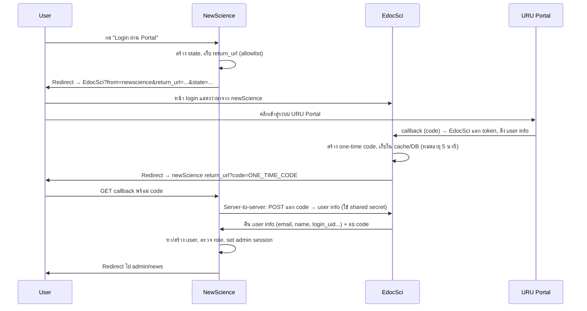

# แผนเชื่อมต่อ Login ผ่าน Portal (แบบที่ 1 – ผ่าน EdocSci)

## ข้อจำกัด

**ไม่สามารถขอ OAuth client ใหม่จาก URU Portal ได้** ดังนั้น newScience ต้องใช้การ Login ผ่านแอป EdocSci (edoc.sci.uru.ac.th) ที่มี client_id `edoc_sci` อยู่แล้ว แล้วให้ EdocSci ส่งผู้ใช้กลับมา newScience หลัง login สำเร็จ

---

## Flow โดยรวม

---

## ความปลอดภัย (แบบที่ 1)

| หัวข้อ | วิธีทำ |
|--------|--------|
| **Open Redirect** | EdocSci อนุญาตเฉพาะ `return_url` ที่ขึ้นต้นด้วยโดเมนที่ลงทะเบียน (allowlist เช่น `https://newscience...`) |
| **การปลอม callback** | newScience ไม่เชื่อ query อย่างเดียว — ต้องเรียก API ฝั่ง EdocSci เพื่อแลก `code` เป็น user info (server-to-server) |
| **Replay / ใช้ code ซ้ำ** | `code` ใช้ครั้งเดียว (one-time) หลังแลกแล้วลบหรือ invalidate ทันที; ตั้งหมดอายุสั้น (เช่น 5 นาที) |
| **ความลับระหว่างแอป** | ใช้ shared secret (หรือ API key) ระหว่าง EdocSci กับ newScience สำหรับ request แลก code (อยู่ใน env/config ไม่ hardcode) |
| **CSRF** | ใช้ `state` จาก newScience ไปกับ redirect ไป EdocSci แล้ว EdocSci ส่ง `state` กลับมาใน return_url — newScience ตรวจใน callback |

---

## งานฝั่ง EdocSci (edoc.sci.uru.ac.th)

1. **หน้า login รองรับ query**
   - `from=newscience` — แสดงข้อความว่ามาจากเว็บ newScience
   - `return_url=...` — URL ที่ EdocSci จะ redirect กลับหลัง login (ต้องผ่าน allowlist)
   - `state=...` — ส่งต่อกลับไปที่ return_url เพื่อให้ newScience ตรวจ CSRF

2. **Allowlist return_url**
   - อนุญาตเฉพาะโดเมนที่กำหนด เช่น `https://sci.uru.ac.th`, `https://newscience...` (ตามที่ตกลง)
   - ถ้า `return_url` ไม่อยู่ใน allowlist ไม่ redirect ไปที่นั้น

3. **หลัง OAuth callback สำเร็จ (เมื่อมี from=newscience + return_url)**
   - สร้าง one-time code (random, เก็บใน cache หรือ DB)
   - เก็บค่า: code → user info (uid, email, login_uid, ชื่อ ฯลฯ) หมดอายุใน 5 นาที
   - Redirect ไปที่ `return_url` โดยเพิ่ม query: `?code=ONE_TIME_CODE&state=STATE_FROM_REQUEST`

4. **API สำหรับ newScience แลก code เป็น user info**
   - Endpoint เช่น `POST https://edoc.sci.uru.ac.th/api/exchange-newscience-code` หรือ path ที่ตกลงกัน
   - Request: `code=...` และ header หรือ body มี shared secret (หรือ API key)
   - ตรวจว่า code ถูกต้อง ยังไม่ใช้ ยังไม่หมดอายุ
   - คืน JSON: user info (email, login_uid, first_name_th, last_name_th, ...) แล้วลบ/ทำให้ code ใช้แล้ว

---

## งานฝั่ง newScience

1. **ปุ่ม / ลิงก์ "Login ผ่าน Portal"**
   - ชี้ไปที่ route ใหม่ เช่น `GET /admin/portal-login`
   - ไม่ส่ง return_url ผ่านฟอร์มจาก client (เพื่อลดความเสี่ยง open redirect ฝั่ง client)

2. **GET /admin/portal-login**
   - สร้าง `state` (random), เก็บใน session: `oauth_state`, `oauth_return_url` = URL ภายใน newScience ที่จะรับ callback (เช่น `base_url('admin/oauth-callback')`)
   - Redirect ไป EdocSci:  
     `https://edoc.sci.uru.ac.th/auth/login?from=newscience&return_url=ENCODED_CALLBACK_URL&state=STATE`  
   - `return_url` คือ URL callback ของ newScience (ไม่ให้ user กำหนดเอง)

3. **GET /admin/oauth-callback**
   - รับ `code`, `state`
   - ตรวจ `state` กับ session `oauth_state` (แล้วลบ state)
   - เรียก EdocSci API (server-to-server) ส่ง `code` + shared secret เพื่อแลก user info
   - ถ้าได้ user info: หา user จาก `login_uid` หรือ `email`; ถ้าไม่มีและนโยบายอนุญาตให้สร้างก็สร้าง; ตรวจ role (admin/editor/super_admin) ถ้าไม่ใช่ให้ redirect กลับ login พร้อมข้อความ
   - Set session เหมือน form login: `admin_logged_in`, `admin_id`, `admin_email`, `admin_name`, `admin_role`
   - Redirect ไป `redirect_url` ที่เก็บใน session หรือ `admin/news`

4. **Config**
   - เก็บใน config/env: URL หน้า login EdocSci, URL API แลก code, shared secret (หรือ API key) ระหว่าง newScience กับ EdocSci

5. **ไม่ต้องมี OAuthService เรียก URU Portal โดยตรง** — newScience ไม่มี client_id กับ Portal; ทุกอย่างผ่าน EdocSci

---

## สรุปไฟล์ที่เกี่ยวข้อง (newScience)

| งาน | ไฟล์ |
|-----|------|
| Config (URL EdocSci, shared secret) | `app/Config/OAuth.php` หรือ .env |
| Client เรียก API EdocSci แลก code | สร้าง `app/Services/EdocSciAuthService.php` หรือคล้ายกัน |
| Auth Controller | `app/Controllers/Admin/Auth.php`: เพิ่ม `portalLogin()`, `oauthCallback()` |
| UserModel | ใช้ `findByLoginUid`, `findByIdentifier`; อาจเพิ่มสร้าง user จาก API |
| Routes | เพิ่ม `admin/portal-login`, `admin/oauth-callback` |
| View login | `app/Views/admin/auth/login.php`: เพิ่มปุ่ม "Login ผ่าน Portal" |

---

## สิ่งที่ต้องตกลงกับทีม EdocSci

1. รูปแบบ query บนหน้า login: `from`, `return_url`, `state`
2. Allowlist โดเมนสำหรับ `return_url` (รายการโดเมน newScience ที่อนุญาต)
3. รูปแบบ API แลก code: URL, method, วิธีส่ง shared secret, รูปแบบ JSON response (ฟิลด์ user)
4. อายุ one-time code (แนะนำ 5 นาที)

เมื่อตกลงแล้ว สามารถ implement ตามแผนนี้ได้โดยไม่ต้องขอ OAuth client ใหม่จาก URU Portal
