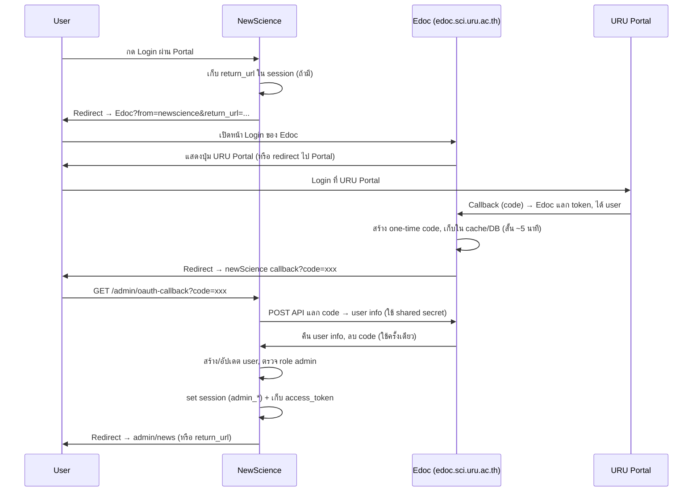

# แผน SSO Login ผ่าน Edoc (เก็บ Session และ Token)

## วัตถุประสงค์

- ผู้ใช้กด Login ที่ newScience → ไปล็อกอินที่ **edoc.sci.uru.ac.th** (URU Portal ผ่าน Edoc)
- หลังล็อกอินสำเร็จ Edoc ส่งผู้ใช้กลับ newScience พร้อม one-time code
- newScience แลก code กับ Edoc ได้ข้อมูลผู้ใช้ แล้ว **สร้าง session ของ Admin และเก็บ token**
- ไม่ต้องขอ OAuth client ใหม่จาก URU Portal (ใช้ client ของ Edoc)

---

## Flow โดยรวม

---

## 1. ฝั่ง newScience

### 1.1 Routes (เพิ่มใน `app/Config/Routes.php`)

- `GET  /admin/portal-login` → `Admin\Auth::portalLogin` (ไม่มี filter)
- `GET  /admin/oauth-callback` → `Admin\Auth::oauthCallback` (ไม่มี filter)

### 1.2 Controller `Admin\Auth`

- **portalLogin()**

  - ถ้า login แล้ว → redirect ไป admin/news
  - เก็บ `redirect_url` จาก query หรือ session (จาก AdminAuthFilter) ไว้ใน session
  - Redirect ไป `https://edoc.sci.uru.ac.th/auth/login?from=newscience&return_url=<callback_url>`
  - `return_url` ต้องเป็น URL เต็มของ newScience callback เช่น `https://newscience-domain/admin/oauth-callback` (หรืออ่านจาก config)

- **oauthCallback()**
  - รับ `code` (และ `error` ถ้ามี)
  - ถ้ามี error → redirect กลับ admin/login พร้อมข้อความ error
  - เรียก Edoc API: POST แลก code เพื่อขอ user info (ส่ง code + shared secret หรือ signature)
  - ได้ user info (email, name, code/login_uid, ...) → **processPortalUser()**
  - processPortalUser: หา user จาก `UserModel` ด้วย email หรือ login_uid; ถ้าไม่มีให้สร้าง (หรือปฏิเสธถ้านโยบายให้เฉพาะ user ที่มีอยู่แล้ว); ตรวจ role ต้องเป็น admin/editor/super_admin ถึงจะให้เข้า
  - Set session: `admin_logged_in`, `admin_id`, `admin_email`, `admin_name`, `admin_role`
  - **เก็บ token**: เก็บ `access_token` (ที่ได้จาก Edoc API ตอบกลับ) ใน session เช่น `admin_access_token`, `admin_token_expires` (ถ้า Edoc ส่ง expiry มา)
  - ล้าง `redirect_url` แล้ว redirect ไปที่เก็บไว้ หรือไป admin/news

### 1.3 Config

- ไฟล์ config (เช่น `app/Config/EdocSso.php` หรือใน `.env`):
  - `edoc_sso.base_url` = `https://edoc.sci.uru.ac.th`
  - `edoc_sso.return_url` = URL เต็มของ newScience callback
  - `edoc_sso.exchange_code_url` = URL ของ Edoc API สำหรับแลก code (เช่น `https://edoc.sci.uru.ac.th/api/sso/exchange-code` หรือตามที่ตกลง)
  - `edoc_sso.shared_secret` = ค่าลับร่วมกับ Edoc (ใช้ sign request หรือส่งใน header)

### 1.4 View หน้า Login

- ใน `app/Views/admin/auth/login.php` เพิ่มปุ่มหรือลิงก์ **"Login ผ่าน URU Portal (Edoc)"** ชี้ไปที่ `base_url('admin/portal-login')`
- เก็บฟอร์มล็อกอินแบบเดิม (อีเมล/รหัสผ่าน) ไว้เป็นทางเลือก

### 1.5 การเก็บ Session และ Token

- Session ที่ต้อง set หลัง callback สำเร็จ:

  - `admin_logged_in` = true
  - `admin_id` = uid (จากตาราง user ของ newScience)
  - `admin_email`, `admin_name`, `admin_role`
  - `admin_access_token` = token ที่ได้จาก Edoc (ใช้เรียก API ภายหลังได้ถ้า Edoc รองรับ)
  - `admin_token_expires` = เวลาหมดอายุ (ถ้ามี)
  - `admin_login_via` = 'edoc_sso' (เพื่อแยกว่าล็อกอินจาก Portal)

- ไม่ต้องเปลี่ยน `AdminAuthFilter` ถ้า filter ยังเช็คแค่ `admin_logged_in` และ role ตามเดิม

---

## 2. ฝั่ง Edoc (edoc.sci.uru.ac.th)

ต้องมีการแก้ไขโปรเจกต์ Edoc ดังนี้

### 2.1 หน้า Login รองรับ query `from` และ `return_url`

- ใน route/controller ที่แสดงหน้า login (เช่น `AuthenController::login`) อ่าน `from`, `return_url` จาก query
- เก็บใน session เช่น `sso_from`, `sso_return_url`
- ตรวจ **allowlist return_url**: อนุญาตเฉพาะโดเมนที่กำหนด (เช่น `https://sci.uru.ac.th`, `https://newscience...`) ไม่ redirect ไป URL อื่นตามที่ user ส่งมา
- แสดงข้อความบนหน้า login ว่า "เข้าสู่ระบบสำหรับ newScience" เมื่อ `from=newscience`

### 2.2 หลัง OAuth callback สำเร็จ (ใน AuthenController::callback)

- หลังได้ user และ set session ของ Edoc แล้ว
- ถ้ามี `sso_return_url` ใน session (และผ่าน allowlist แล้ว):
  - สร้าง **one-time code**: random string เก็บใน cache หรือ DB พร้อม user info (หรือ user_id) และหมดอายุใน 5–10 นาที
  - ส่งกลับโดย redirect ไปที่ `sso_return_url?code=<one_time_code>`
  - ลบ `sso_from`, `sso_return_url` ออกจาก session
- ถ้าไม่มี sso_return_url → ทำงานเหมือนเดิม (redirect ไป UserPanel)

### 2.3 API แลก code เป็น user info (ใหม่)

- Endpoint เช่น `POST /api/sso/exchange-code` (หรือ path ที่ตกลง)
- Request body: `code`, และ header หรือ body มี `secret` / signature ที่ใช้ shared secret กับ newScience
- ตรวจ secret ถูกต้อง
- หา code ใน cache/DB ถ้าไม่มีหรือหมดอายุ → return 401
- อ่าน user info ที่ผูกกับ code แล้วส่งกลับเป็น JSON (เช่น email, first_name_th, last_name_th, first_name_en, last_name_en, code เป็น login_uid, และถ้าต้องการให้ส่ง access_token ด้วย)
- **ลบหรือ invalidate code** หลังใช้แล้ว (ใช้ได้ครั้งเดียว)

### 2.4 Allowlist return_url

- กำหนดรายการ URL ที่อนุญาต (config หรือ DB) เช่น:
  - `https://sci.uru.ac.th/admin/oauth-callback`
  - `http://localhost/...` เฉพาะสำหรับ dev
- ก่อน redirect ไป return_url ต้องเช็คว่า return_url ขึ้นต้นด้วยค่าที่อยู่ใน allowlist

---

## 3. ความปลอดภัย

| หัวข้อ                       | การทำ                                                                                             |
| ---------------------------- | ------------------------------------------------------------------------------------------------- |
| One-time code                | Code ใช้ครั้งเดียว หมดอายุสั้น (5–10 นาที)                                                        |
| ตรวจ return_url              | Edoc ใช้ allowlist โดเมน/URL ไม่รับค่า return_url ตามที่ user ส่งโดยตรง                           |
| การสื่อสาร newScience ↔ Edoc | ใช้ shared secret (หรือ HMAC) ใน request แลก code เพื่อให้ Edoc ไว้ใจว่า request มาจาก newScience |
| Token ใน session             | เก็บใน session เฉพาะ server-side ไม่ส่งไปที่ client (หรือเก็บใน cookie httpOnly)                  |
| HTTPS                        | ใช้ HTTPS ใน production ทั้ง newScience และ Edoc                                                  |

---

## 4. สรุปงานที่ต้องทำ

### newScience

1. เพิ่ม config สำหรับ Edoc SSO (base_url, return_url, exchange_code_url, shared_secret)
2. เพิ่ม route `admin/portal-login`, `admin/oauth-callback`
3. ขยาย `Admin\Auth`: `portalLogin()`, `oauthCallback()`, `processPortalUser()` และการเก็บ session + token
4. แก้ view หน้า login ให้มีปุ่ม "Login ผ่าน URU Portal (Edoc)"

### Edoc

1. แก้หน้า login ให้รับและเก็บ `from`, `return_url` (และตรวจ allowlist)
2. แก้ callback หลัง OAuth สำเร็จ: ถ้ามี sso_return_url ให้สร้าง one-time code แล้ว redirect ไป return_url?code=...
3. สร้าง API แลก code → user info (และ optional access_token) ใช้ shared secret
4. ตั้งค่า allowlist return_url และ shared secret กับ newScience

เมื่อทำครบ ผู้ใช้จะล็อกอินผ่าน Edoc ได้ครั้งเดียว และ newScience จะได้ทั้ง session และ token ไว้ใช้ต่อได้ตามที่ต้องการ

---

## 5. Log สำหรับตรวจสอบ

### newScience (Admin Auth SSO)

- **ที่เก็บ log**: `writable/logs/log-YYYY-MM-DD.log` (หรือตาม [Logger config](app/Config/Logger.php))
- **Prefix**: ทุกบรรทัด SSO ขึ้นต้นด้วย `Admin Auth SSO: `

| เหตุการณ์               | ระดับ   | ข้อความตัวอย่าง                                              |
| ----------------------- | ------- | ------------------------------------------------------------ |
| กด Login ผ่าน Portal    | info    | `portalLogin redirect to Edoc return_url=...`                |
| รับ callback พร้อม code | info    | `oauthCallback code=(present) error= error_description=`     |
| แลก code สำเร็จ         | info    | `user info received email=...`                               |
| แลก code ล้มเหลว        | error   | `exchangeCode failed` หรือ `exchangeCode non-200 status=...` |
| ผู้ใช้ไม่มีสิทธิ์ admin | warning | `processPortalUser denied (no user or no admin role)`        |
| Login สำเร็จ            | info    | `oauthCallback login success uid=... role=... redirect=...`  |
| Logout (เคยล็อกอิน SSO) | info    | `logout admin_id=... login_via=edoc_sso`                     |

### Edoc (Edoc SSO)

- **ที่เก็บ log**: โฟลเดอร์ log ของ EdocSci (เช่น `writable/logs/`)
- **Prefix**: ฝั่ง login/callback ใช้ `Edoc SSO: ` ฝั่ง API ใช้ `Edoc SSO API: `

| เหตุการณ์                                       | ระดับ   | ข้อความตัวอย่าง                                         |
| ----------------------------------------------- | ------- | ------------------------------------------------------- |
| เปิดหน้า login จาก newScience                   | info    | `login from=newscience return_url=...`                  |
| return_url ไม่อยู่ใน allowlist                  | warning | `login return_url not in allowlist: ...`                |
| หลัง OAuth สำเร็จ สร้าง code ส่งกลับ newScience | info    | `callback created one-time code redirect to newScience` |
| API รับ request แลก code                        | info    | `exchangeCode request code=(present) secret=(present)`  |
| API secret ไม่ตรง                               | warning | `exchangeCode invalid secret`                           |
| API code ไม่พบ/หมดอายุ                          | warning | `exchangeCode code not found or expired`                |
| API แลก code สำเร็จ                             | info    | `exchangeCode success email=...`                        |

### วิธีตรวจสอบ flow

1. เปิด log ของ newScience แล้วกด "Login ผ่าน URU Portal (Edoc)" — ควรเห็น `portalLogin redirect to Edoc`
2. เปิด log ของ Edoc แล้วเปิดหน้า login ที่มี query `from=newscience&return_url=...` — ควรเห็น `login from=newscience`
3. หลังล็อกอินที่ Portal แล้วถูก redirect กลับ newScience — ฝั่ง Edoc ควรเห็น `callback created one-time code` ฝั่ง newScience ควรเห็น `oauthCallback` แล้วตามด้วย `user info received` และ `login success` หรือ `processPortalUser denied`
4. ถ้าแลก code ไม่ผ่าน ดู newScience log หา `exchangeCode` (response status / invalid response) และ Edoc log หา `exchangeCode` (invalid secret / code not found)
